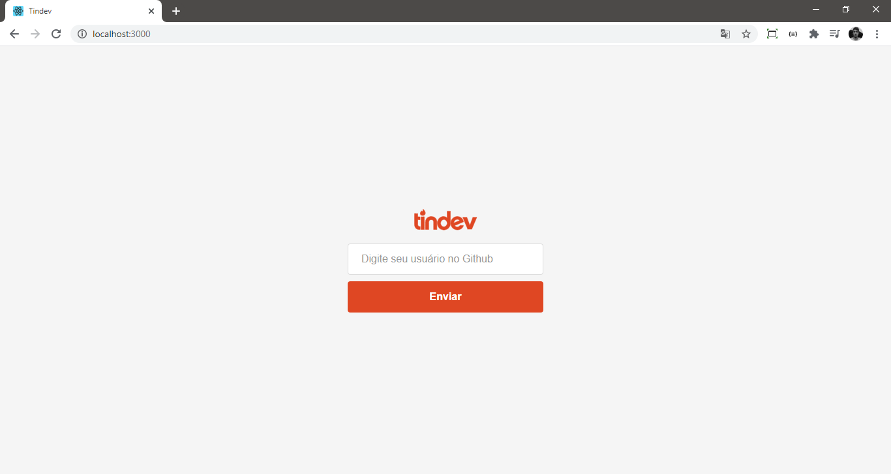
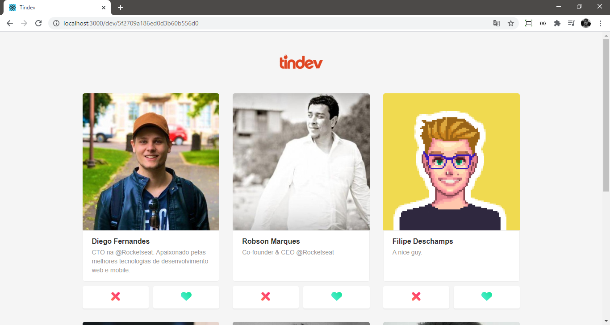
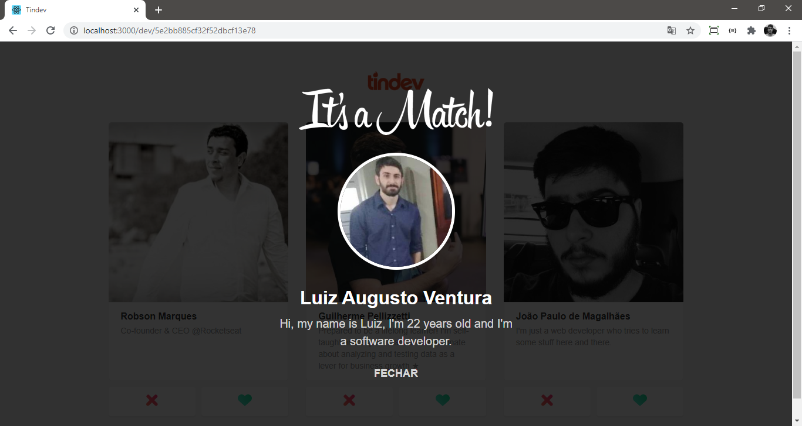
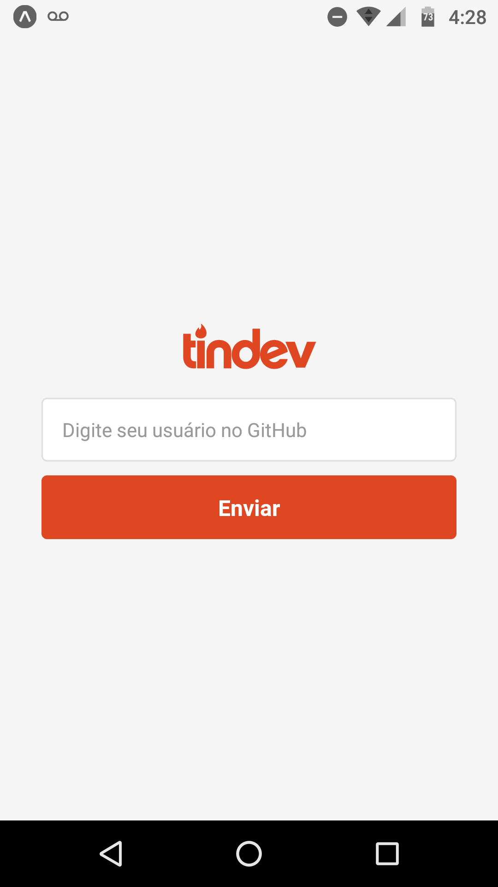

<h1 
    align="center"
    style="color: orange;"
>
    🤓 Tindev: Encontre o dev perfeito 💻
</h1>

<h3
    style="color: #A50"
>
    Encontre o seu pair programming, um dev para sua empresa, ou até mesmo um sócio para fundar sua startup tecnológica!
</h3>

Desenvolvido durante a Semana OmniStack 8 (evento realizado pela Rocketseat), o Tindev é uma aplicação Tinder-style que conecta desenvolvedores a partir da api do GitHub.

<h4>🛠 Tecnologias e ferramentas: 🛠</h4>
<ul>
    <li>Node.JS</li>
    <li>ReactJS</li>
    <li>React Native</li>
    <li>MongoDB</li>
</ul>

<h4>📷 Capturas de tela: 📷</h4>
<table>
    <tr><td colspan="3" align="center"><strong>Aplicação web</strong></td></tr>
    <tr>
        <td>
            
        </td>
    </tr>
    <tr>
        <td>
            
        </td>
    </tr>
    <tr>
        <td>
            
        </td>
    </tr>
</table>
<table>
    <tr><td colspan="3" align="center"><strong>Aplicação mobile</strong></td></tr>
    <tr>
        <td>
            
        </td>
        <td>
            
        </td>
        <td>
            
        </td>
    </tr>
</table>
